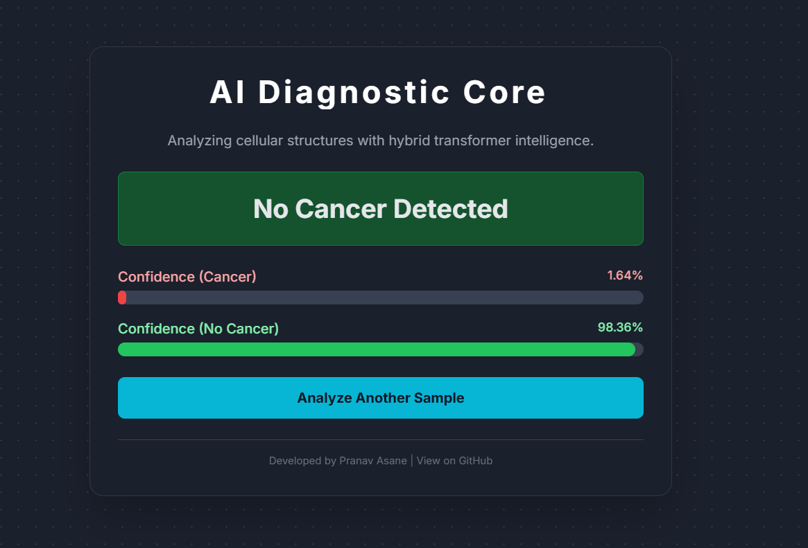

AI-Powered Histopathology Cancer Detection Web App
This is a complete, end-to-end deep learning application for detecting metastatic cancer in histopathologic image patches. The project features a custom-built Hybrid Attention-CNN Transformer (HACT) model, a Flask backend API, and a dynamic, single-page web interface.

Note: A live, deployed version of this application is available on Hugging Face Spaces!
View Live Demo Here

Key Features
Unique AI Model: Implements a custom Hybrid Attention-CNN Transformer (HACT) architecture, combining the feature extraction power of EfficientNetV2 with the contextual understanding of a Transformer.

Interactive Web Interface: A sleek, dark-mode frontend built with HTML, Tailwind CSS, and vanilla JavaScript allows users to easily upload an image and receive an instant prediction with dynamic feedback.

RESTful API Backend: The model is served via a robust Flask and Gunicorn backend, making it scalable and easy to interact with.

End-to-End Workflow: The repository includes the original Kaggle notebooks, showcasing the entire development process from data exploration and augmentation to model training and evaluation.

Containerized for Deployment: The entire application is containerized using Docker, ensuring consistent and reliable deployment on platforms like Hugging Face Spaces.

Project Structure
├── kaggle-development/      # Jupyter notebooks and scripts for model development
├── .gitignore               # Specifies files for Git to ignore
├── Dockerfile               # Blueprint for building the deployment container
├── flask_app.py             # The Flask backend server and API endpoint
├── hact_model_epoch_10.pth  # The final trained model weights (tracked with Git LFS)
├── index.html               # The single-page frontend application
├── README.md                # Project documentation (this file)
└── requirements.txt         # Python dependencies for the backend

Technology Stack
Backend: Python, Flask, Gunicorn

AI / ML: PyTorch, Timm, Albumentations, Scikit-learn

Frontend: HTML, Tailwind CSS, JavaScript

Deployment: Docker, Hugging Face Spaces

Development: Jupyter Notebooks, Pandas, NumPy

Local Setup and Usage
Follow these steps to run the application on your local machine.

Step 1: Clone the Repository
git clone [https://github.com/asanepranav/AI-Cancer-Detector-WebApp.git](https://github.com/asanepranav/AI-Cancer-Detector-WebApp.git)
cd AI-Cancer-Detector-WebApp

Step 2: Create and Activate a Conda Environment
It is highly recommended to use a Conda environment to manage dependencies.

# Create the environment
conda create -n cancer-app python=3.9 -y

# Activate the environment
conda activate cancer-app

Step 3: Install Dependencies
Install all the necessary Python libraries from the requirements file.

pip install -r requirements.txt

Step 4: Run the Backend Server
Start the Flask application using the recommended Flask command. This will launch the development server.

flask --app flask_app run

The server will be running at http://127.0.0.1:5000. Keep this terminal window open.

Step 5: Launch the Frontend
Open the index.html file in your web browser to use the application. The frontend will automatically connect to your running local backend.

Deployment on Hugging Face Spaces
This project is designed to be deployed as a Docker container on Hugging Face Spaces. Follow these steps to deploy your own version.

Step 1: Ensure Your GitHub Repository is Up-to-Date
Before deploying, make sure you have pushed all the latest code (including the Dockerfile and requirements.txt) to your GitHub repository.

Step 2: Create a New Space on Hugging Face
Log in to your Hugging Face account. If you have an old, non-working Space, delete it from its "Settings" page to avoid confusion.

Click on your profile icon and select "New Space".

Fill in the details:

Space name: Choose a name for your application.

License: Select MIT.

Select the Space SDK: This is the most important step. You must select "Docker".

Link to GitHub: After selecting Docker, a text box will appear. Paste the full URL of your GitHub repository here.

Space hardware: The free "CPU basic" tier is sufficient.

Click the "Create Space" button.

Step 3: Monitor the Build
Hugging Face will automatically clone your repository and start the build process using your Dockerfile. You can watch the progress in the "Logs" tab. The initial build may take 5-10 minutes.

Once the status changes to "Running", your application will be live and accessible from the "App" tab.